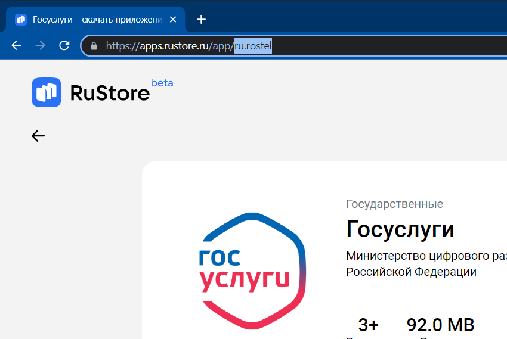

# Интеграция с RuStore

Интеграция с Rustore осуществляется через [mdast_cli](https://github.com/Dynamic-Mobile-Security/mdast-cli).

## Сбор необходимых параметров

Чтобы скачать приложение с [RuStore](https://www.rustore.ru/), необходимо знать имя пакета. При запуске скрипта оно передается с параметром `rustore_package_name`.

<figure markdown></figure>

Кроме этого, потребуется указать соответствующую систему дистрибьюции (`distribution_system rustore`).

## Примеры запуска скрипта

!!! note "Примечание"
    Более подробная информация об остальных параметрах запуска скрипта приведена в разделе «[Системы CI/CD/Параметры запуска](./sistemy_ci_cd.md#_4)».

После сбора необходимых параметров можно, запустив скрипт, скачать приложение и начать его сканирование.

``` bash hl_lines="7 8"
mdast_cli \
  --url "https://saas.mobile.appsec.world"
  --profile_id 1
  --company_id 1
  --architecture_id 1
  --token "eyJ**********QiLbJhcGciO5JIU4I1NiJ1..."
  --distribution_system rustore # (1)
  --rustore_package_name ru.rostel # (2)
  --testcase_id 4
  --file_path "/files/demo/apk/test.apk"
```

1. Система дистрибьюции
2. Имя пакета приложения