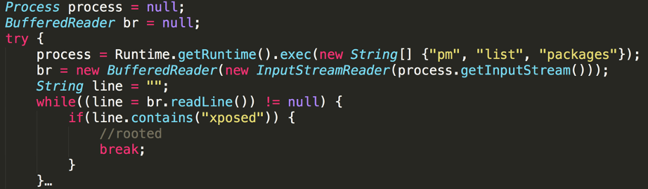
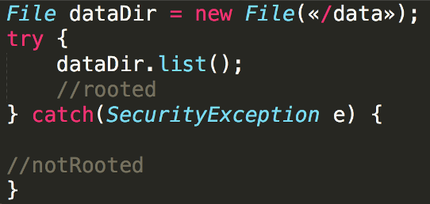
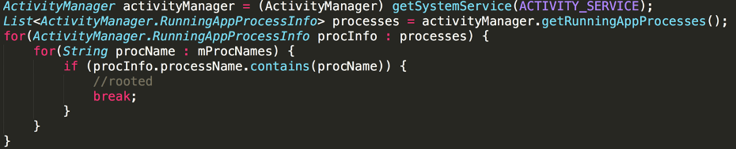

# Отсутствие проверки на root-доступ

<table class='noborder'>
    <colgroup>
      <col/>
      <col/>
    </colgroup>
    <tbody>
      <tr>
        <td rowspan="2"></td>
        <td>Критичность:<strong> СРЕДНЯЯ</strong></td>
      </tr>
      <tr>
        <td>Способ обнаружения:<strong> IAST</strong></td>
      </tr>
    </tbody>
</table>

## Описание

Запуск и работа приложений в ОС без проверки окружения может нести значительные риски.

Злоумышленник или легальный пользователь могут запускать приложение на устройстве с правами root с целью создания фейковых аккаунтов, накруток различных показателей, исследования взаимодействия приложения с ОС и другими приложениями, а также исследования взаимодействия приложения по сети, в том числе с серверной частью (исследование API). Установка и работа в таком окружении значительно снижает безопасность данных пользователя и потенциально увеличивает риск финансовых и репутационных потерь для поставщика приложения.

Запуск приложения на устройстве, на котором пользователь имеет права root, серьезно снижает существующие защитные механизмы ОС Андроид. Пользователю и в некоторых случаях приложениям становятся доступны приватное хранилище, запуск неэкспортированных компонентов и другие опасные действия.

## Рекомендации

Приложение при запуске и во время работы должно проверять косвенные и непосредственные значения параметров ОС, указывающие на наличие прав root и эмулятора.

Для определения прав root возможны следующие проверки:

* **Поиск файлов** из списка: `"su"`, `"busybox"`, `"supersu"`, `"Superuser.apk"`, `"KingoUser.apk"`, `"SuperSu.apk"`, `"magisk"`, к примеру:

        public static final String[] paths = {"/system", "/system/bin", "/system/sbin", "/system/xbin", "/vendor/bin", "/sbin", "/etc"};
        public boolean chekBinaryFile(String fileName) {
            boolean result = false;
            for (String path : paths) {
                if (new File(path, fileName).exists()) {
                    Log.d("detect", "binary " + fileName + "detected");
                    result = true;
                }
            }
            return result;
        }

* **Проверка наличия характерных для «рутованных» устройств пакетов:** `"com.noshufou.android.su"`, `"com.noshufou.android.su.elite"`, `"eu.chainfire.supersu"`, `"com.koushikdutta.superuser"`, `"com.thirdparty.superuser"`, `"com.yellowes.su"`, `"com.koushikdutta.rommanager"`, `"com.koushikdutta.rommanager.license"`, `"com.dimonvideo.luckypatcher"`, `"com.chelpus.lackypatch"`, `"com.ramdroid.appquarantine"`, `"com.ramdroid.appquarantinepro"`, `"com.devadvance.rootcloak"`, `"com.devadvance.rootcloakplus"`, `"de.robv.android.xposed.installer"`, `"com.saurik.substrate"`, `"com.zachspong.temprootremovejb"`, `"com.amphoras.hidemyroot"`, `"com.amphoras.hidemyrootadfree"`, `"com.formyhm.hiderootPremium"`, `"com.formyhm.hideroot"`, `"me.phh.superuser"`, `"eu.chainfire.supersu.pro"`, `"com.kingouser.com"`, `"com.topjohnwu.magisk"`.

    **Пример кода:**

            String[] rootPackages = {
                    "com.noshufou.android.su", "com.noshufou.android.su.elite", "eu.chainfire.supersu",
                    "com.koushikdutta.superuser", "com.thirdparty.superuser", "com.yellowes.su", "com.koushikdutta.rommanager",
                    "com.koushikdutta.rommanager.license", "com.dimonvideo.luckypatcher", "com.chelpus.lackypatch",
                    "com.ramdroid.appquarantine", "com.ramdroid.appquarantinepro", "com.devadvance.rootcloak", "com.devadvance.rootcloakplus",
                    "de.robv.android.xposed.installer", "com.saurik.substrate", "com.zachspong.temprootremovejb", "com.amphoras.hidemyroot",
                    "com.amphoras.hidemyrootadfree", "com.formyhm.hiderootPremium", "com.formyhm.hideroot", "me.phh.superuser",
                    "eu.chainfire.supersu.pro", "com.kingouser.com", "com.topjohnwu.magisk", "com.koushikdutta.superuser", "com.thirdparty.superuser",
                    "com.yellowes.su", "com.topjohnwu.magisk", "com.kingroot.kinguser", "com.kingo.root", "com.smedialink.oneclickroot", "com.zhiqupk.root.global",
                    "com.alephzain.framaroot", "com.koushikdutta.rommanager", "com.koushikdutta.rommanager.license", "com.dimonvideo.luckypatcher", "com.chelpus.lackypatch",
                    "com.ramdroid.appquarantine", "com.ramdroid.appquarantinepro", "com.android.vending.billing.InAppBillingService.COIN", "com.chelpus.luckypatcher"
            };

            boolean checkRootPackages(String[] arr) {
                List<String> pkgs = Arrays.asList(arr);
                StringBuilder s = new StringBuilder();
                PackageManager pm = getPackageManager();
                for (PackageInfo packageInfo : pm.getInstalledPackages(PackageManager.GET_META_DATA)) {
                    if (pkgs.contains(packageInfo.packageName)) {
                        return true;
                    }
                }
                return false;
            }

* **Проверка системных свойств:** `"ro.build.selinux"`, `"ro.debuggable"`, `"service.adb.root"`, `"ro.secure"`.

    **Пример кода:**

            try {
                propertyStream = Runtime.getRuntime().exec("getprop").getInputStream();
            } catch (IOException | NoSuchElementException e) {
                e.printStackTrace();
            }
            if (propertyStream == null) {
                // no accesss to getprop
            } else {
                BufferedReader bufferedReader = new BufferedReader(
                        new InputStreamReader(propertyStream));
                StringBuilder log = new StringBuilder();
                String line;
                try {
                    while ((line = bufferedReader.readLine()) != null) {
                    //getprop возвращает список свойств в виде списка
                    // [<propertyName>]:[<propertyvalue>]
                    }

* **Запуск команд через shell**, к примеру поиск  бинарного файла ***su*** (`process = Runtime.getRuntime().exec(new String[]{"which", "su"});`)

    <figure markdown></figure>

* **Проверка режимов доступа к файлам и директориям.**

Можно проверить, имеются ли права на чтение для директории `/data`.

Для проверки наличия этих прав могут использоваться методы Java API:

* `File.canRead`,

* `File.canWrite`,

* а также метод языка C — `access()`.

Также, можно попытаться создать временный файл в одной из директорий (для проверки прав записи) или прочитать содержимое директории (для проверки прав чтения).

<figure markdown></figure>

или

<figure markdown></figure>

* **Проверка запущенных процессов/приложений**

Метод `ActivityManager.getRunningAppProcesses` возвращает список запущенных процессов.

Он может быть использован для поиска тех приложений, которые требуют root-привилегий.

Аналогично, методы `getRunningServices` и/или `getRecentTasks` могут быть использованы для поиска запущенных сервисов и задач приложений.

<figure markdown></figure>

И еще несколько советов:

* Не используйте стандартные имена переменных `isRooted/ rooted`.

* Можно использовать простую модель с накоплением и границей. То есть, для каждой проверки назначается некоторый вес и, при превышении порогового значения, приложение считает, что устройство скомпроментировано.

* Нужно продумать, что именно делать в случае обнаружения root, запрещать ли пользователю работать с приложением или просто уведомлять его? Также хорошо бы передавать эту информацию в профильные подразделения, например в антифрод.

* Одним из хороших способов является использование библиотек [DetectFrida](https://github.com/darvincisec/DetectFrida) и [DetectMagiskHide](https://github.com/darvincisec/DetectMagiskHide). 
Данные библиотеки реализуют проверки в нативном коде, что существенно усложняет их анализ и модификацию.

* Стоит учитывать, что существуют приложения, которые скрывают root-доступ и определить его будет сложнее:

    * Magisk.

    * RootCloak.

## Ссылки

1. [Android how to check phone rooted or not ? 2022 - Codeplayon](https://www.codeplayon.com/2020/07/android-how-to-check-phone-rooted-or-not/)

2. [Android – Determining if an Android device is rooted programmatically? – iTecNote](https://itecnote.com/tecnote/android-determining-if-an-android-device-is-rooted-programmatically/) 

3. [Detecting Root on Android](https://medium.com/@scottyab/detecting-root-on-android-97803474f694) 

4. [M10: Lack of Binary Protections | OWASP Foundation](https://owasp.org/www-project-mobile-top-10/2014-risks/m10-lack-of-binary-protections) 

5. [owasp-mstg/0x05j-Testing-Resiliency-Against-Reverse-Engineering.md at master · OWASP/owasp-mstg](https://github.com/OWASP/owasp-mstg/blob/master/Document/0x05j-Testing-Resiliency-Against-Reverse-Engineering.md)