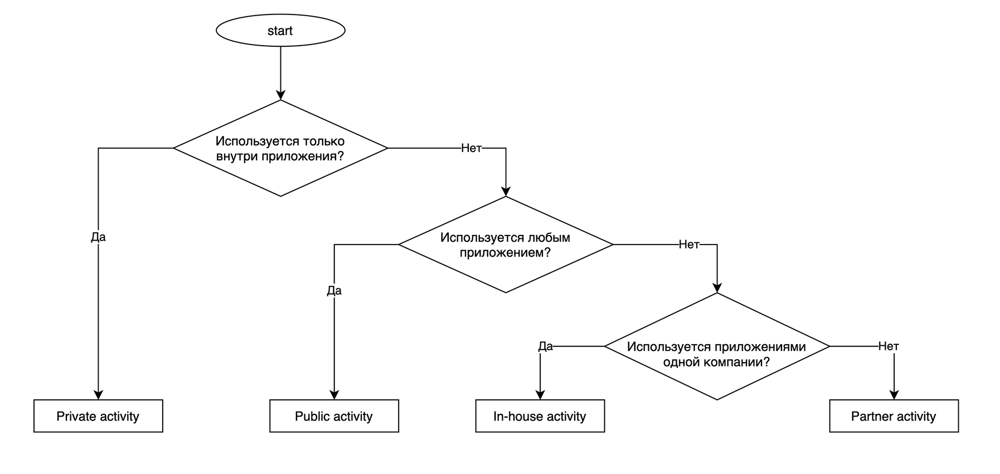

# Передача sensitive-информации во внутреннюю Activity

<table class='noborder'>
    <colgroup>
      <col/>
      <col/>
    </colgroup>
    <tbody>
      <tr>
        <td rowspan="2"></td>
        <td>Критичность:<strong> ИНФО</strong></td>
      </tr>
      <tr>
        <td>Способ обнаружения:<strong> DAST, SENSITIVE INFO</strong></td>
      </tr>
    </tbody>
</table>

## Описание

Приложение включает чувствительную информацию в **Intent** для запуска внутренней **Activity**. В общем случае это не является уязвимостью, но при наличии root-доступа на устройстве такой способ передачи данных может считаться небезопасным.

Межпроцессное взаимодействие (IPC) в Android осуществляться при помощи специальных объектов — **Intent**. Параметры обработчиков **Intent** задаются в основной файле манифеста приложения — ***AndroidManifest.xml*** либо, в случае с динамическими **BroadcastReceivers**, в коде приложения. В случае, если используется неявные **Intent** (не содержат имени конкретного компонента, вместо этого они в целом объявляют действие, которое требуется выполнить, что дает возможность компоненту из другого приложения обработать этот запрос, например, если требуется показать пользователю место на карте, то с помощью неявного объекта **Intent** можно запросить, чтобы это сделало другое приложение, в котором такая возможность предусмотрена), данные, содержащиеся в таких сообщениях, могут быть скомпрометированы. Кроме того, вредоносными приложениями могут использоваться механизмы делегирования управления процесса, такие как неявные вызовы компонентов приложений или объекты типа **PendingIntent**, для перехвата потока управления и фишинговых атак.

Опасность представляют объекты типов **Activity**, **Service**, **BroadcastReceiver** и **ContentProvider**, открытые для взаимодействия с другими приложениями и не относящиеся к системным Android-вызовам (таким как `android.intent.action.MAIN`). **BroadcastReceiver** по умолчанию открыт для взаимодействия с другими приложениями, в этом случае возможен перехват **Intent** с конфиденциальной информацией или перехват управления.

## Рекомендации

При использовании неявных **Intent** (когда пользователь сам определяет, какое приложение должно обработать сообщение) **нельзя** включать sensitive-информацию в параметры.

Риски при использовании **Activity** и соответствующие им защитные меры различаются в зависимости от того, как используется эта **Activity**. Мы выделяем 4 типа **Activity** в зависимости от способов использования. Для определения типа **Activity**, которую планируется создавать, необходимо воспользоваться таблицей и диаграммой, представленными ниже.

<figure markdown>

</figure>

<figure markdown>

</figure>

**Создание и использование private Activity**

**Private Activity** не может запускаться из других приложений и, поэтому, является наиболее защищённой.

Для запуска **Private Activity** используется явный **Intent** (с указанием имени класс), поэтому нет необходимости беспокоиться о возможности непреднамеренной отправки данных в стороннее приложение. Однако, остаётся риск того, что стороннее приложение сможет получить доступ к содержимому **Intent**, который был использован для запуска **Activity**. Поэтому, если для запуска **Activity** используется **Intent**, содержащий чувствительную информацию, то важно позаботиться о мерах защиты, чтобы вредоносное приложение не смогло прочитать эту информацию.

**Правила (создание private Activity):**

* Не используйте `taskAffinity`.
* Не используйте `launchMode`.
* Явно указывайте атрибут `exported="false"`.
* Проводите проверку и безопасную обработку полученного **Intent**, несмотря на то, что он был получен из того же самого приложения.
* В **Intent** результата можно включать конфиденциальную информацию, т.к. его отправка и получение происходит внутри приложения.

**AndroidManifest.xml**

    <?xml version="1.0" encoding="utf-8"?>
    <manifest xmlns:android="http://schemas.android.com/apk/res/android"
    package="com.appsec.android.activity.privateactivity" >
    <application
    android:allowBackup="false"
    android:icon="@drawable/ic_launcher"
    android:label="@string/app_name" >
    <!-- Private activity -->
    <!-- *** 1 *** Не используйте taskAffinity -->
    <!-- *** 2 *** Не используйте launchMode -->
    <!-- *** 3 *** Явно указывайте атрибут exported="false" -->
    <activity
    android:name=".PrivateActivity"
    android:label="@string/app_name"
    android:exported="false" />
    <!-- Public activity запускаемая по умолчанию -->
    <activity
    android:name=".PrivateUserActivity"
    android:label="@string/app_name"
    android:exported="true" >
    <intent-filter>
    <action android:name="android.intent.action.MAIN" />
    <category android:name="android.intent.category.LAUNCHER" />
    </intent-filter>
    </activity>
    </application>
    </manifest>

**PrivateActivity.java**

    package com.appsec.android.activity.privateactivity;
    
    import android.app.Activity;
    import android.content.Intent;
    import android.os.Bundle;
    import android.view.View;
    import android.widget.Toast;
    
    public class PrivateActivity extends Activity {
        
        @Override
        public void onCreate(Bundle savedInstanceState) {
            super.onCreate(savedInstanceState);
            setContentView(R.layout.private_activity);
            
            // *** 4 *** Проводите безопасную обработку полученного Intent, даже если он был получен из того же самого приложения
            // См.п. "Безопасная обработка входных данных"
            
            String param = getIntent().getStringExtra("PARAM");
            Toast.makeText(this, String.format("Received param: %s", param), Toast.LENGTH_LONG).show();
        }
        
        public void onReturnResultClick(View view) {
            // *** 5 *** В Intent результата можно включать конфиденциальную информацию, т.к. его отправка и получение происходит внутри приложения.
            Intent intent = new Intent();
            intent.putExtra("RESULT", "Sensitive Info");
            setResult(RESULT_OK, intent);
            finish();
        }
    }

**Правила (использование private Activity):**

1. Не устанавливайте флаг `FLAG_ACTIVITY_NEW_TASK` в **Intent**, который будет использоваться для запуска **Activity**.
2. Используйте явный **Intent** с указанием имени класса **Activity** внутри приложения.
3. В **Intent**, используемый для запуска **Activity**, можно включать конфиденциальную информацию (но только с помощью метода `putExtra`), т.к. его отправка и получение происходит внутри приложения.
4. Проводите проверку и безопасную обработку полученных данных результата, несмотря на то, что они были получены из **Activity** того же самого приложения.

**PrivateUserActivity.java**

    package com.appsec.android.activity.privateactivity;
    
    import android.app.Activity;
    import android.content.Intent;
    import android.os.Bundle;
    import android.view.View;
    import android.widget.Toast;
    
    public class PrivateUserActivity extends Activity {
        
        private static final int REQUEST_CODE = 1;
        
        @Override
        public void onCreate(Bundle savedInstanceState) {
            super.onCreate(savedInstanceState);
            setContentView(R.layout.user_activity);
        }
        
        public void onUseActivityClick(View view) {
            // *** 1 *** Не устанавливайте флаг FLAG_ACTIVITY_NEW_TASK в **Intent**, который будет использоваться для запуска Activity
            // *** 2 *** Используйте явный Intent с указанием имени класса Activity внутри приложения
            Intent intent = new Intent(this, PrivateActivity.class);
            
            // *** 3 *** В Intent, используемый для запуска Activity,
            // можно включать конфиденциальную информацию но только с помощью метода `putExtra`),
            // т.к. его отправка и получение происходит внутри приложения
            intent.putExtra("PARAM", "Sensitive Info");
            startActivityForResult(intent, REQUEST_CODE);
        }
    
        @Override
        public void onActivityResult(int requestCode, int resultCode, Intent data) {
            super.onActivityResult(requestCode, resultCode, data);
            
            if(resultCode != RESULT_OK) return;
            
            switch(requestCode) {
                case REQUEST_CODE:
                    String result = data.getStringExtra("RESULT");
                    
                    // *** POINT 4 *** Проводите безопасную обработку полученных данных результата,
                    // даже если они были получен из Activity того же самого приложения
                    // См.п. "Безопасная обработка входных данных"
                    Toast.makeText(this, String.format("Received result: %s, result), Toast.LENGTH_LONG).show();
                    break;
            }
        }
    }

## Ссылки

1. [https://developer.android.com/guide/components/intents-filters?hl=ru](https://developer.android.com/guide/components/intents-filters?hl=ru)

2. [https://github.com/OWASP/owasp-mstg/blob/master/Document/0x05h-Testing-Platform-Interaction.md](https://github.com/OWASP/owasp-mstg/blob/master/Document/0x05h-Testing-Platform-Interaction.md)

3. [https://developer.android.com/training/basics/intents/index.html](https://developer.android.com/training/basics/intents/index.html)