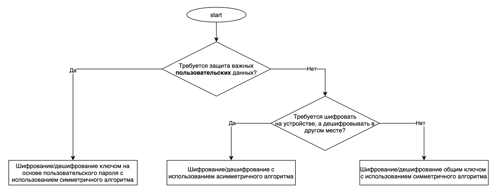

# Хранение или использование ранее найденной sensitive-информации

<table class='noborder'>
    <colgroup>
      <col/>
      <col/>
    </colgroup>
    <tbody>
      <tr>
        <td rowspan="2"></td>
        <td>Критичность:<strong> СРЕДНИЙ</strong></td>
      </tr>
      <tr>
        <td>Способ обнаружения:<strong> DAST, API</strong></td>
      </tr>
    </tbody>
</table>

## Описание

Приложение хранит или использует при своей работе чувствительную информацию.

Во время своей работы приложение часто оперирует чувствительной информацией, такой как пароли, различные токены, ключи шифрования и т. д. Во время проведения анализа приложения Stingray определяем такую информацию согласно правилам поиска и дополнительно проверяет, что найденная чувствительная информация хранится в неизменном виде или используется приложением в других функциях или [“зашита“ в исходном коде приложения](./storing_sensitive_information_in_the_application_source_code.md).

## Рекомендации

При необходимости использования чувствительной информации в приложении необходимо убедиться, что она правильно хранится и не попадает в общедоступные места, как, например, системные логи (logcat) или файлы приложения на sd-карте.

При необходимости хранения такой информации рекомендуется использовать шифрование. Для обеспечения конфиденциальности Android оснащена множеством криптографических функций и методов, с помощью которых приложения Android могут безопасно осуществлять шифрование и дешифрование (для обеспечения конфиденциальности), а также аутентификацию сообщений (MAC) и цифровые подписи (для проверки целостности).

Для того, чтобы выбрать подходящий в заданных условиях метод шифрования и тип ключа, можно воспользоваться следующей схемой:

<figure markdown>

</figure>

**Шифрование/дешифрование с использованием Android KeyStore**

Для примера рассмотрим шифрование/дешифрование с использованием Android KeyStore. Данный механизм позволяет генерировать и использовать ключи, сгенерированные в аппаратном хранилище ключей Android. Такой подход является наиболее защищенным с точки зрения хранения ключей, так как закрытый ключ никогда не появляется в памяти, что минимизирует риск его утечки или компрометации.

**Создание новых ключей**

Прежде чем начать процесс шифрования, необходимо задать alias, который будет использован для шифрования / дешифрования данных. Это может быть любая строка. Alias — это имя записи, по которому можно будет обращаться к сгенерированному ключу в Android KeyStore.

Для начала, необходимо получить экземпляр [Android KeyGenerator](https://developer.android.com/reference/javax/crypto/KeyGenerator).

    final KeyGenerator keyGenerator = KeyGenerator
            .getInstance(KeyProperties.KEY_ALGORITHM_AES, "AndroidKeyStore");

В данном примере используется алгоритм AES, и ключи будут храниться в AndroidKeyStore.

Далее нужно создать [KeyGenParameterSpec](https://developer.android.com/reference/android/security/keystore/KeyGenParameterSpec.html), используя [KeyGenParameterSpec.Builder](https://developer.android.com/reference/android/security/keystore/KeyGenParameterSpec.Builder.html) для передачи в метод инициализации [KeyGenerators](https://developer.android.com/reference/android/security/keystore/KeyGenParameterSpec.Builder.html).

**Что такое KeyGenParameterSpec?**

KeyGenParameterSpec — это некоторые свойства ключей, которые будут сгенерированы. Например, можно указать срок действия ключа, его назначение, и различные другие параметры.

    final KeyGenerator keyGenerator = KeyGenerator
            .getInstance(KeyProperties.KEY_ALGORITHM_AES, ANDROID_KEY_STORE);
    final KeyGenParameterSpec keyGenParameterSpec = new KeyGenParameterSpec.Builder(alias,
            KeyProperties.PURPOSE_ENCRYPT | KeyProperties.PURPOSE_DECRYPT)
            .setBlockModes(KeyProperties.BLOCK_MODE_GCM)
        .setEncryptionPaddings(KeyProperties.ENCRYPTION_PADDING_NONE)
            .build();

В приведенном примере первым аргументом передаётся alias, который будет использован в дальнейшем для обращения к этому ключу. Затем указывается цель этого ключа — зашифровать и расшифровать данные. В `setBlockModes` указывается режим, в котором будет применяться данный ключ, поскольку мы используем алгоритм преобразования «**AES** / **GCM** / **NoPadding**», необходимо указать `BLOCK_MODE_GCM` и последним параметром указывается режим дополнения (`ENCRYPTION_PADDING_NONE`).

**Шифрование данных**

Предварительные настройки завершены. Для шифрования данных возможно использовать следующий пример:

    final KeyGenerator keyGenerator = KeyGenerator
            .getInstance(KeyProperties.KEY_ALGORITHM_AES, ANDROID_KEY_STORE);
    final KeyGenParameterSpec keyGenParameterSpec = new KeyGenParameterSpec.Builder(alias,
            KeyProperties.PURPOSE_ENCRYPT | KeyProperties.PURPOSE_DECRYPT)
            .setBlockModes(KeyProperties.BLOCK_MODE_GCM)
        .setEncryptionPaddings(KeyProperties.ENCRYPTION_PADDING_NONE)
            .build();
    keyGenerator.init(keyGenParameterSpec);
    final SecretKey secretKey = keyGenerator.generateKey();
    final Cipher cipher = Cipher.getInstance("AES/GCM/NoPadding");
    cipher.init(Cipher.ENCRYPT_MODE, secretKey);

Сначала происходит инициализация keyGenerator с помощью [keyGenParameterSpec](http://developer.android.com/reference/android/security/keystore/KeyGenParameterSpec.html). После этого — непосредственно генерация [SecretKey](https://developer.android.com/reference/javax/crypto/SecretKey.html).

Теперь, когда есть секретный ключ, можно использовать его для инициализации объекта [Cipher](https://developer.android.com/reference/javax/crypto/Cipher.html), который фактически и отвечает за шифрование.

    final KeyGenerator keyGenerator = KeyGenerator
            .getInstance(KeyProperties.KEY_ALGORITHM_AES, ANDROID_KEY_STORE);
    final KeyGenParameterSpec keyGenParameterSpec = new KeyGenParameterSpec.Builder(alias,
            KeyProperties.PURPOSE_ENCRYPT | KeyProperties.PURPOSE_DECRYPT)
            .setBlockModes(KeyProperties.BLOCK_MODE_GCM)
            .setEncryptionPaddings(KeyProperties.ENCRYPTION_PADDING_NONE)
            .build();
    keyGenerator.init(keyGenParameterSpec);
    final SecretKey secretKey = keyGenerator.generateKey();
    final Cipher cipher = Cipher.getInstance(TRANSFORMATION);
    cipher.init(Cipher.ENCRYPT_MODE, secretKey);
    iv = cipher.getIV();
    encryption = cipher.doFinal(textToEncrypt.getBytes("UTF-8"));

Затем используется ссылка на вектор инициализации (IV), который так же необходим для дешифрования, и с помощью `doFinal (textToEncrypt)` завершаем операцию шифрования. Метод `doFinal` возвращает массив байтов, который является зашифрованным текстом.

**Расшифровка данных**

**Запуск KeyStore**

Прежде чем начать расшифровывать данные, нам понадобится экземпляр `KeyStore`.

    keyStore = KeyStore.getInstance("AndroidKeyStore");
    keyStore.load(null);

`KeyStore` используется, чтобы получить закрытый ключ, используя `alias`, который ранее использовалcя при шифровании данных.

Необходим `SecretKeyEntry` из хранилища ключей, чтобы получить из него `secretKey`.

    keyStore = KeyStore.getInstance("AndroidKeyStore");
    keyStore.load(null);
    final KeyStore.SecretKeyEntry secretKeyEntry = (KeyStore.SecretKeyEntry) keyStore
            .getEntry(alias, null);
    final SecretKey secretKey = secretKeyEntry.getSecretKey();

Используем `GCMParameterSpec` с `Cipher` для инициализации процесса дешифрования (параметр `encryptionIv` — это вектор инициализации, который использовался при шифровании).

    keyStore = KeyStore.getInstance("AndroidKeyStore");
    keyStore.load(null);
    final KeyStore.SecretKeyEntry secretKeyEntry = (KeyStore.SecretKeyEntry) keyStore
            .getEntry(alias, null);
    final SecretKey secretKey = secretKeyEntry.getSecretKey();
    final Cipher cipher = Cipher.getInstance("AES/GCM/NoPadding");
    final GCMParameterSpec spec = new GCMParameterSpec(128, encryptionIv);
    cipher.init(Cipher.DECRYPT_MODE, secretKey, spec);

И, как и раньше, для получения расшифрованных данных:

    final byte[] decodedData = cipher.doFinal(encryptedData);

Чтобы получить незашифрованное строковое представление:

    final String unencryptedString = new String(decodedData, "UTF-8");

[Полный исходный код примера](https://gist.github.com/JosiasSena/3bf4ca59777f7dedcaf41a495d96d984).

## Ссылки

1. [https://medium.com/@josiassena/using-the-android-keystore-system-to-store-sensitive-information-3a56175a454bhttps://mobile-security.gitbook.io/mobile-security-testing-guide/android-testing-guide/0x05d-testing-data-storage](https://medium.com/@josiassena/using-the-android-keystore-system-to-store-sensitive-information-3a56175a454bhttps://mobile-security.gitbook.io/mobile-security-testing-guide/android-testing-guide/0x05d-testing-data-storage)

2. [https://gist.github.com/JosiasSena/3bf4ca59777f7dedcaf41a495d96d984https://cwe.mitre.org/data/definitions/200.html](https://gist.github.com/JosiasSena/3bf4ca59777f7dedcaf41a495d96d984https://cwe.mitre.org/data/definitions/200.html)

3. [https://developer.android.com/reference/javax/crypto/KeyGenerator.html](https://developer.android.com/reference/javax/crypto/KeyGenerator.html)

4. [https://developer.android.com/reference/android/security/keystore/KeyGenParameterSpec.html](https://developer.android.com/reference/android/security/keystore/KeyGenParameterSpec.html)

5. [https://developer.android.com/reference/android/security/keystore/KeyGenParameterSpec.Builder.html](https://developer.android.com/reference/android/security/keystore/KeyGenParameterSpec.Builder.html)

6. [https://developer.android.com/reference/android/security/keystore/KeyProperties.html](https://developer.android.com/reference/android/security/keystore/KeyProperties.html)

7. [https://developer.android.com/reference/javax/crypto/SecretKey.html](https://developer.android.com/reference/javax/crypto/SecretKey.html)

8. [https://developer.android.com/reference/javax/crypto/Cipher.html](https://developer.android.com/reference/javax/crypto/Cipher.html)

9. [https://developer.android.com/reference/javax/crypto/spec/GCMParameterSpec.html](https://developer.android.com/reference/javax/crypto/spec/GCMParameterSpec.html)