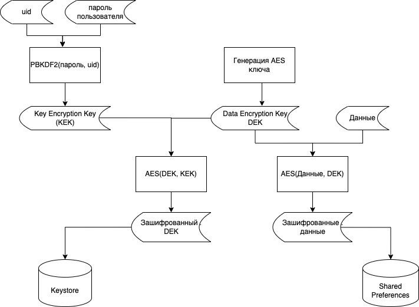

# Хранение sensitive-информации в приватном файле

<table class='noborder'>
    <colgroup>
      <col/>
      <col/>
    </colgroup>
    <tbody>
      <tr>
        <td rowspan="2"></td>
        <td>Критичность:<strong> ИНФО</strong></td>
      </tr>
      <tr>
        <td>Способ обнаружения:<strong> DAST, ФАЙЛЫ ПРИЛОЖЕНИЯ</strong></td>
      </tr>
    </tbody>
</table>

## Описание

Приложение хранит чувствительную информацию в приватном файле внутри директории приложения.

Для того, чтобы понять, какие именно данные необходимо защищать, прежде всего необходимо определить, какие данные обрабатывает и хранит приложение и какая часть этой информации считается конфиденциальной. Как правило, в таких случаях полагаются на законодательство и здравый смысл. Нет смысла защищать шифрованием абсолютно всю информацию, которую хранит приложение — это может повлиять на скорость и стабильность работы. Вместо этого следует однозначно определить, какие именно данные для приложения или компании являются конфиденциальными, и сосредоточить свое внимание именно на этих данных.

Принято считать, что необходимо хранить как можно меньше конфиденциальных данных в локальном хранилище (внутреннем или внешнем). Однако в большинстве случаев хранения такой информации избежать не удастся. Например, с точки зрения удобства использования не стоит заставлять пользователя вводить сложный пароль при каждом запуске приложения. Большинство приложений должны локально кэшировать какой-либо токен аутентификации. Персонально идентифицируемая информация (PII) и другие типы конфиденциальных данных также могут быть сохранены, если этого требует конкретный сценарий.

Приложение может хранить данные в различных форматах, в базах данных, кэшированных сетевых запросах и много где еще.

Значение из внутренней директории приложения может быть получено через локальный или облачный бекапы, а также при помощи эксплуатации различных уязвимостей.

!!! note "Внимание!"
    Очень часто ошибочно считается, что данные, которые хранятся во внутренней директории приложения, уже защищены при помощи механизма песочницы и злоумышленник до них не доберется. Существует большое количество способов, начиная от простого локального или облачного бекапа приложения и заканчивая физическим доступом к устройству и эксплуатации различных уязвимостей. **Информация, размещенная в открытом виде внутри директории приложения, не защищена!**

## Рекомендации

Любую чувствительную информацию, которая хранится на устройстве, необходимо шифровать. Это можно сделать самыми разными способами и один из таких способов — это шифрование на основе ключей, которые генерируются в защищенном хранилище Security Enclave. Apple приложила много усилий, чтобы сделать процедуру шифрования проще и удобнее. 

### Процесс создания ключей в Security Enclave:

1. Шаги для создания приватного ключа в Secure Enclave (и соответствующего публичного ключа) практически аналогичны созданию ключа в обычной ситуации:

        let access =
                SecAccessControlCreateWithFlags(kCFAllocatorDefault,
                                                kSecAttrAccessibleWhenUnlockedThisDeviceOnly,
                                                .privateKeyUsage,
                                                nil)!   // Ignore error

2. Используя объект access control, создадим словарь:

        let attributes: [String: Any] = [
            kSecAttrKeyType as String:            type,
            kSecAttrKeySizeInBits as String:      256,
            kSecAttrTokenID as String:            kSecAttrTokenIDSecureEnclave,
            kSecPrivateKeyAttrs as String: [
                kSecAttrIsPermanent as String:      true,
                kSecAttrApplicationTag as String:   <# a tag #>,
                kSecAttrAccessControl as String:    access
            ]
        ]

3. Теперь, когда у нас есть словарь, создадим ключевую пару аналогично тому, как это делается за пределами Security Enclave — вызвав функцию SecKeyCreateRandomKey():

        var error: Unmanaged<CFError>?
            guard let privateKey = SecKeyCreateRandomKey(attributes as CFDictionary, &error) else {
                throw error!.takeRetainedValue() as Error
            }

4. Теперь созданные ключи можно использовать для шифрования или подписи данных. Но применять можно только эллиптические алгоритмы, так как Security Enclave поддерживает лишь эллиптические ключи:

        var error: Unmanaged<CFError>?
            guard let cipherText = SecKeyCreateEncryptedData(publicKey,
                                                            algorithm,
                                                            plainText as CFData,
                                                            &error) as Data? else {
                                                                throw error!.takeRetainedValue() as Error
            }

Такой порядок создания и использования описан в официальной документации, ну или можно использовать обвязки для упрощения всех процедур, как вариант — библиотеку [EllipticCurveKeyPair](https://github.com/agens-no/EllipticCurveKeyPair).

В дополнение к этому можно применять алгоритмы, которые вообще не требуют хранения ключа, а создают его «на лету» из некоторых данных пользователя (например, его пароля или пин-кода). Такие алгоритмы называют процедурой расширения ключа. Они позволяют получить из небольшого количества информации длинный и хороший ключ для шифрования. Например, этот механизм можно использовать в подходе KEK&DEK (Key Encryption Key & Data Encryption Key). Такой подход проще всего показать на блок-схеме:

<figure markdown>

<figcaption>Примерная схема с использованием двух ключей</figcaption>
</figure>

При этом подходе мы сначала создаем ключ для шифрования данных (Data Encryption Key), затем на нем зашифровываем данные и уже этот ключ шифруем при помощи нового ключа (Key Encryption Key). Как раз этот KEK можно либо сохранить в Keystore/Security Enclave, либо генерировать каждый раз (например, на основе пароля пользователя). При таком механизме мы избавляемся от перешифровки данных в случае изменения/компрометации ключа. Нам достаточно перешифровать только DEK и не трогать данные (конечно, это не так, если у нас скомпрометирован DEK, но такой вариант маловероятен). В этом случае, каков бы ни был объем данных, которые нужно сохранить в секрете, время перешифрования всегда будет одинаковым, так как сами зашифрованные данные мы не трогаем. Кстати, такой подход используется в iPhone для шифрования данных в файловой системе (там, конечно все еще сложнее, но принцип именно такой).

## Ссылки

1. [https://developer.apple.com/documentation/security/keychain_services](https://developer.apple.com/documentation/security/keychain_services) 
2. [https://developer.apple.com/documentation/security/certificate_key_and_trust_services/keys/storing_keys_in_the_secure_enclave](https://developer.apple.com/documentation/security/certificate_key_and_trust_services/keys/storing_keys_in_the_secure_enclave) 
3. [https://developer.apple.com/documentation/security/certificate_key_and_trust_services/keys/using_keys_for_encryption](https://developer.apple.com/documentation/security/certificate_key_and_trust_services/keys/using_keys_for_encryption) 
4. [https://github.com/agens-no/EllipticCurveKeyPair](https://github.com/agens-no/EllipticCurveKeyPair) 